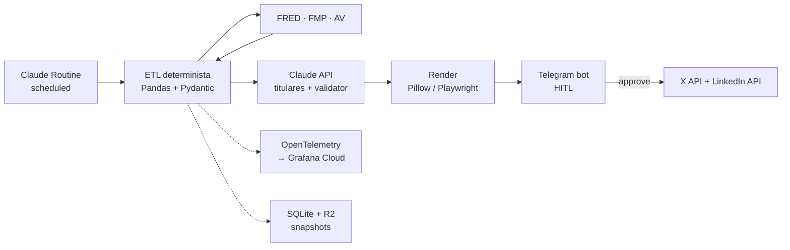

# MacroPipeline

> Pipeline automatizado que ingesta datos macroeconómicos de fuentes públicas, los procesa de forma determinista, los renderiza visualmente y los publica multi-canal con aprobación humana asistida.

[](https://github.com/SimonChiabo/MacroPipeline/actions/workflows/ci.yml)
[](https://github.com/SimonChiabo/MacroPipeline/actions/workflows/contract-tests.yml)
[](https://codecov.io/gh/SimonChiabo/MacroPipeline)
[](https://www.python.org/downloads/)
[](https://opensource.org/licenses/MIT)

Proyecto de portfolio. Demuestra arquitectura production-grade para un sistema de datos financieros: determinismo, validación, observabilidad, resiliencia ante APIs externas, y human-in-the-loop como kill switch natural. **No es asesoramiento financiero.**

---

## Qué hace

Cada viernes, cuando cierra el mercado americano, el pipeline:

1. Ingesta datos de FRED, FMP y Alpha Vantage con retry/fallback.
2. Procesa los números en Python determinista (sin LLM cerca de los datos).
3. Valida con Pydantic + reglas declarativas en YAML + comparación histórica.
4. Genera titulares con Claude API y los pasa por un *validator agent* de segunda opinión.
5. Renderiza plantillas distintas para X y LinkedIn sobre un data layer compartido.
6. Envía el draft a un bot de Telegram con preview y botones de aprobación.
7. Si aprueba, publica vía APIs nativas. Si no, descarta y queda registrado.

Toda la ejecución se observa con OpenTelemetry y Grafana Cloud. Los datos crudos de cada run se archivan como snapshots inmutables en Cloudflare R2 para reproducibilidad. El fichero de estado de SQLite también viaja por R2: no sobrevive a un entorno efímero, y sin él la deduplicación que promete ADR-002 no se sostiene.

---

## Arquitectura



Diagrama detallado en [`PLAN.md`](./PLAN.md).

---

## Stack

| Capa | Tecnología |
|---|---|
| Ingesta | Python 3.12 · FRED · FMP · Alpha Vantage |
| Procesamiento | Pandas · Pydantic · reglas YAML |
| LLM auxiliar | Claude Haiku 4.5 (titulares + validator agent) |
| Orquestación | Claude Routines (scheduled triggers) |
| Renderizado | Pillow (simples) · Playwright/HTML (complejos) |
| Plantillas | Diseñadas en Claude Design, una por canal |
| Publicación | X API v2 · LinkedIn API (Company Page) |
| Aprobación | Telegram bot (long polling) |
| Observabilidad | structlog · OpenTelemetry · Grafana Cloud |
| Storage | SQLite (queue, sincronizado contra R2) · Cloudflare R2 (snapshots + estado) |
| CI/CD | GitHub Actions · pre-commit · Codecov |

---

## Decisiones de diseño

El proyecto está documentado con **Architecture Decision Records** en [`docs/adr/`](./docs/adr/). Las más relevantes:

- [ADR-001](./docs/adr/001-llm-out-of-numbers.md) — El LLM no toca números. Solo titulares y validación.
- [ADR-002](./docs/adr/002-claude-routines.md) — Claude Routines como orquestador, GitHub Actions como plan B.
- [ADR-003](./docs/adr/003-templates-per-channel.md) — Plantillas por canal sobre data layer compartido.
- [ADR-004](./docs/adr/004-hitl-first-month.md) — Human-in-the-loop primeros 30 días.
- [ADR-008](./docs/adr/008-contract-tests.md) — Contract tests nightly contra APIs reales.
- [ADR-009](./docs/adr/009-degradation-policy.md) — Qué fallo degrada y qué fallo aborta, componente por componente.

Para el plan completo, ver [`PLAN.md`](./PLAN.md).

---

## Setup local

```bash
# Clonar
git clone https://github.com/SimonChiabo/MacroPipeline
cd macro-pipeline

# Entorno
python -m venv .venv
source .venv/bin/activate
pip install -e ".[dev]"

# Configurar (API keys de FRED, FMP, Alpha Vantage, Anthropic, Telegram, X, LinkedIn)
cp .env.example .env
$EDITOR .env

# Verificar que las credenciales sirven de verdad (no publica; para R2
# escribe y borra un objeto de prueba en tu bucket)
python scripts/check_credentials.py

# Hooks
pre-commit install

# Tests con fixtures (rápido)
pytest tests/unit tests/integration

# Correr el cierre semanal (publica de verdad; se detiene en Telegram
# esperando tu aprobacion, y rechazar el borrador no publica nada)
python src/macro_pipeline/orchestration/main.py
```

---

## El token de LinkedIn vence cada ~60 días

Se reemite a mano desde el token generator del portal: con este montaje
(`w_member_social`) no hay refresh programático, así que rotar es coste externo
y lo único que el repo puede hacer es avisar a tiempo.

El nightly avisa por Telegram los días **50, 55, 58 y después todos los días**,
y además autentica la credencial contra `/v2/userinfo` en cada corrida, así que
un token **revocado** también se caza.

**Al rotar hay que actualizar la fecha en dos sitios:**

```sh
# 1. El .env local
LINKEDIN_TOKEN_ISSUED=2026-10-20

# 2. La variable del repo, que es la que lee el nightly
gh variable set LINKEDIN_TOKEN_ISSUED --body "2026-10-20"
```

Si no querés rotarlo, `PUBLISH_LINKEDIN=false` apaga la red y silencia el aviso
—en el `.env` y en `gh variable set PUBLISH_LINKEDIN --body "false"`—. Al
volver a encenderlo, la fecha vieja hace que el primer nightly avise solo.

---

## Secrets en GitHub

El nightly de contract tests (`.github/workflows/contract-tests.yml`) corre
contra las APIs reales, así que necesita credenciales en **Settings → Secrets
and variables → Actions**. El `.env` local no viaja a Actions.

| Secret | Obligatorio | Para qué |
|---|---|---|
| `FRED_API_KEY` | Sí | Sin esto el nightly no puede verificar ningún contrato. |
| `TELEGRAM_BOT_TOKEN` | No | Envía la alerta cuando el nightly falla. |
| `TELEGRAM_CHAT_ID` | No | Destinatario de esa alerta. |
| `FMP_API_KEY` | Todavía no | Reservado para los contract tests de FMP. |
| `ALPHA_VANTAGE_API_KEY` | Todavía no | Ídem, Alpha Vantage. |
| `CODECOV_TOKEN` | No | Subida de cobertura; el job no falla sin él. |

```sh
gh secret set FRED_API_KEY -R SimonChiabo/MacroPipeline
gh secret set TELEGRAM_BOT_TOKEN -R SimonChiabo/MacroPipeline
gh secret set TELEGRAM_CHAT_ID -R SimonChiabo/MacroPipeline
gh secret list -R SimonChiabo/MacroPipeline   # verificar
```

El workflow comprueba los secrets **antes** de instalar nada y falla nombrando
lo que falta. Los de Telegram solo generan un aviso: que no haya canal de
alerta degrada el aviso, no la verificación. `ci.yml` no necesita ningún
secret — mockea todas las dependencias externas.

---

## Estructura del repo

```
macro-pipeline/
├── src/macro_pipeline/
│   ├── data/              # Clientes API + ETL
│   ├── validators/        # Pydantic + reglas YAML
│   ├── llm/               # Cliente Claude (titulares + validator)
│   ├── templates/         # Plantillas por canal
│   ├── render/            # Pillow + Playwright
│   ├── publishers/        # X + LinkedIn
│   ├── telegram/          # HITL bot
│   ├── observability/     # OTel setup
│   └── orchestration/     # Entry points para Routines
├── tests/
│   ├── unit/              # Lógica pura, sin red
│   ├── integration/       # Con fixtures grabadas
│   ├── contract/          # Contra APIs reales (nightly)
│   └── fixtures/          # Responses JSON grabadas
├── docs/adr/              # Architecture Decision Records
└── .github/workflows/     # CI, contract tests, coverage
```

---

## Roadmap

- ✅ **Semana 0** — Setup administrativo (cuentas, repo, bot)
- 🚧 **Semana 1** — ETL determinista + validación + tests
- ⏳ **Semana 2** — Renderizado + LLM auxiliar
- ⏳ **Semana 3** — Orquestación + HITL Telegram
- ⏳ **Semana 4** — Publicación + observabilidad completa
- ⏳ **Semanas 5-8** — Operación HITL, iteración
- ⏳ **Mes 3** — Migración Telegram → Slack, escala

Detalle completo en [`PLAN.md`](./PLAN.md).

---

## Aprende del proyecto

Si te interesa el patrón de algún componente concreto, las implementaciones de referencia están comentadas:

- **ETL resiliente con fallback** → `src/macro_pipeline/data/`
- **Validator agent con tool-use forzado** → `src/macro_pipeline/llm/validator.py`
- **HITL bot con Telegram long polling** → `src/macro_pipeline/telegram/`
- **Contract tests automatizados** → `tests/contract/`
- **Snapshot tests para renderers** → `tests/integration/test_render.py`

---

## Disclaimer

Proyecto de ingeniería de datos con fines educativos y de portfolio. Los datos provienen de fuentes públicas (FRED, FMP, Alpha Vantage) y se publican respetando los términos de uso de cada proveedor. **El contenido no constituye asesoramiento financiero, fiscal ni de inversión.** Las decisiones financieras son responsabilidad de quien las toma. El autor no se hace responsable del uso que terceros hagan de la información publicada.

---

## Licencia

[MIT](./LICENSE)

---

## Contacto

Construido por [Simon Chiabo](https://github.com/SimonChiabo) · [LinkedIn](https://www.linkedin.com/in/simon-chiabo-38831776/) · [X](https://x.com/MacroPipeline)
