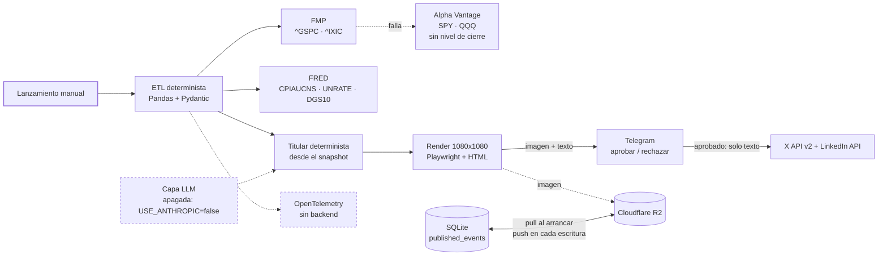

# MacroPipeline

> Cierre semanal del S&P 500 y el Nasdaq Composite: ingesta con fallback entre proveedores de precios, validación por contrato, y gate de aprobación humana antes de publicar en X y LinkedIn. El contexto macroeconómico de FRED es opcional y degrada sin abortar.

[](https://github.com/SimonChiabo/MacroPipeline/actions/workflows/ci.yml)
[](https://github.com/SimonChiabo/MacroPipeline/actions/workflows/contract-tests.yml)
[](https://codecov.io/gh/SimonChiabo/MacroPipeline)
[](https://www.python.org/downloads/)
[](./LICENSE)

Proyecto de portfolio. Lo que hay para mirar es la arquitectura de un sistema de datos que depende de ocho servicios externos y tiene que decidir, para cada uno, si su caída degrada la salida o la cancela.

---

## Estado

Tres cosas distintas, y conviene no mezclarlas:

| | |
|---|---|
| **Corre hoy** | El ETL contra FMP, Alpha Vantage y FRED; la validación; el render; el HITL de Telegram; el estado en SQLite sincronizado contra Cloudflare R2. Se lanza **a mano**: `python src/macro_pipeline/orchestration/main.py`. |
| **Construido, sin una llamada real** | Los publicadores de X y LinkedIn. `post_tweet` y `post_text` están escritos y testeados contra mocks, y nunca se ejecutaron con una aprobación detrás: en `published_events` no hay ninguna fila con `x_post_id` ni con `linkedin_post_id`. Lo único que hoy se autentica de verdad contra LinkedIn es `GET /v2/userinfo`, desde `scripts/check_credentials.py:310`, que el nightly corre cada noche. Contra X no se hace ninguna llamada salvo que se corra el chequeo a mano. |
| **Construido y apagado** | La capa LLM (generador de titulares + validator agent con tool-use forzado). Existe, está testeada y está apagada por configuración: `USE_ANTHROPIC=false`. El titular lo arma el pipeline con las cifras del snapshot. Vuelve cuando tenga un trabajo que sólo ella pueda hacer — ver el camino A en [ROADMAP.md](./ROADMAP.md). |
| **No existe** | El trigger programado. En `.github/workflows/` hay dos workflows y ninguno ejecuta el pipeline. ADR-002 propone Claude Routines y GitHub Actions como plan B; no hay ninguno de los dos montado. Tampoco hay backend de trazas: la corrida abre siete spans de OpenTelemetry —uno raíz y seis de fase— y, sin `OTEL_EXPORTER_OTLP_ENDPOINT`, no se registra ningún exportador y los spans se descartan al cerrarse. |

**Publicaciones: cero.** Ninguna corrida llegó a publicar: no hay una sola fila marcada `published`, ni con un `post_id` de X o de LinkedIn.

```sh
$ python -c "import sqlite3,os; c=sqlite3.connect(os.path.expanduser('~/.macropipeline/state.db')); print(c.execute('select count(*) from published_events where status=? or x_post_id is not null or linkedin_post_id is not null', ('published',)).fetchone()[0])"
0
```

Ese cero es lo que cambia el día que salga el primer post. Las corridas que llegaron al gate se rechazaron a mano, que es el rastro que deja rechazar: `mark_failed(event_id, reason="rejected_by_human")` y salida 0 ([`orchestration/main.py:1112`](./src/macro_pipeline/orchestration/main.py)). El motivo viaja al log y no a la tabla — `published_events` no tiene columna para él, así que la fila sola no distingue un rechazo humano de una excepción. Ese rechazo es la prueba de punta a punta del gate humano, y es la única forma de ensayo que existe hoy: no hay `--dry-run`.

---

## Qué hace

Cada corrida:

1. Pide precios diarios de `^GSPC` y `^IXIC` a FMP, con retry sobre 429 y 5xx. Si FMP falla, cae a `SPY` y `QQQ` de Alpha Vantage.
2. Descarta las sesiones sin terminar, calcula el retorno de cinco días hábiles contra la fecha real, y trae el bloque macro de FRED (`CPIAUCNS`, `UNRATE`, `DGS10`).
3. Valida con Pydantic y con rangos de plausibilidad y umbrales de frescura declarados en [`src/macro_pipeline/validators/rules.yaml`](./src/macro_pipeline/validators/rules.yaml).
4. Arma el titular con las cifras del snapshot, de forma determinista.
5. Renderiza una tarjeta PNG de 1080×1080 con Playwright sobre una plantilla HTML.
6. Manda titular e imagen a un bot de Telegram con botones de aprobar y rechazar, y espera hasta una hora.
7. Si se aprueba, publica el **texto** en X y en LinkedIn. Si se rechaza, no publica y la fila queda registrada.

**Dónde va la imagen:** a la preview de Telegram y a R2. Los dos publicadores mandan sólo texto — `XClient.post_tweet(text)` y `LinkedInClient.post_text(text)` no aceptan otra cosa. Adjuntarla a los posts es trabajo pendiente, no una decisión.

**Por qué el cierre se toma con el mercado cerrado:** el endpoint de precios de FMP devuelve una fila para la sesión en curso, cuyo `close` es el último precio negociado. Medido el 2026-09-02 sobre `^IXIC`: 26.211,996 a las 14:40 UTC y 26.196,812 a las 14:59, con la misma fecha. `_fetch_weekly_close` descarta esas filas corra el día que corra; el horario es conveniencia, no garantía.

---

## Arquitectura



Diagrama detallado en [`PLAN.md`](./PLAN.md).

---

## Lo que hay adentro

Las piezas que justifican el tamaño del repo. Cada una con su archivo.

**El punto de decisión de arranque** — [`orchestration/main.py:509`](./src/macro_pipeline/orchestration/main.py), `_startup_exit_code`. Seis ramas ordenadas, y el orden es parte de la lógica: un switch con un valor ilegible se ve igual que un componente apagado a propósito, así que la rama que lo detecta va primero o el caso más alarmante sale en silencio con código 0. El constructor no puede morir por una credencial ausente; junta los motivos y este método decide, una sola vez, si la corrida sigue y qué se avisa.

**La política de degradación, componente por componente** — [ADR-009](./docs/adr/009-degradation-policy.md). Empieza reconociendo que la política no existía: había cinco decisiones locales tomadas en commits distintos, cada una razonable por separado. Documenta siete divergencias entre lo escrito y el código; **tres siguen abiertas** y están marcadas como tales.

**Switches por componente** — [`components.py`](./src/macro_pipeline/components.py). Ocho componentes con credenciales, ocho variables (`USE_FMP`, `USE_AV`, `USE_FRED`, `USE_ANTHROPIC`, `USE_R2`, `USE_TELEGRAM`, `PUBLISH_X`, `PUBLISH_LINKEDIN`). `build_component` devuelve tres estados distintos y el orquestador los separa: listo, apagado a propósito (se loggea y no alerta — una decisión propia no es un fallo), y encendido y roto (alerta con el motivo). Un valor que no sea `true` ni `false` levanta en vez de adivinar.

**El fallback degrada a propósito** — [`orchestration/main.py:462`](./src/macro_pipeline/orchestration/main.py). Por la ruta de Alpha Vantage el nivel de cierre **no se publica**: FMP cotiza los índices (`^GSPC`, `^IXIC`) y AV cotiza los ETF (`SPY`, `QQQ`), que están a otra escala. El trade-off es explícito: se pierde el nivel, que no sobrevive al cambio de instrumento, y se conserva el retorno, que sí. Publicar 765,72 rotulado «S&P 500» sería una cifra correcta bajo una etiqueta que promete otra cosa.

**Idempotencia parcial por red** — [`orchestration/main.py:801`](./src/macro_pipeline/orchestration/main.py). Si X publicó y LinkedIn falló, relanzar el mismo día publica sólo LinkedIn: `x_already_done` y `linkedin_already_done` salen del estado previo, y el `post_id` se persiste inmediatamente después de cada canal.

**Detección de lock huérfano** — [`orchestration/main.py:655`](./src/macro_pipeline/orchestration/main.py), `_avisar_lock_trabado`. Una muerte no atrapable deja la fila en `in_progress` y ningún `except` la cubre. La función avisa ante cualquier antigüedad implausible —vieja, en el futuro, ilegible, o desconocida porque la fila es anterior a la columna— y **no expira el lock**: auto-expirar uno que podría pertenecer a una corrida viva es el camino a publicar el mismo cierre dos veces.

**Redacción de credenciales en los logs** — [`observability/redaction.py`](./src/macro_pipeline/observability/redaction.py). FRED y FMP exigen la key como query param, así que urllib3 imprime la URL entera cuando reintenta. El filtro actúa a nivel de handler, que es el punto de paso obligado: cubre structlog y las librerías de terceros por igual.

**Qué es exactamente cada cifra publicada** — [`docs/data-dictionary.md`](./docs/data-dictionary.md). Ocho cifras auditadas contra su fuente, con las correcciones que salieron de ahí y lo que queda pendiente. La que más se notó: el IPC interanual salía de `CPIAUCSL` (desestacionalizada) y ahora sale de `CPIAUCNS`, que es la que cita el BLS.

---

## Empezar

Hay dos caminos y no piden lo mismo. El primero funciona en un clon limpio sin configurar nada.

### Correr los tests

```sh
git clone https://github.com/SimonChiabo/MacroPipeline
cd MacroPipeline

python -m venv .venv
source .venv/bin/activate        # Windows: .venv\Scripts\activate

pip install -e ".[dev]"
pytest
```

Sin `.env`, sin claves y sin red:

```
380 passed, 1 skipped, 28 deselected
```

El skip es el chequeo de deriva entre `.env` y `.env.example`, que no tiene nada que comparar sin un `.env` local. Los 28 deseleccionados son los contract tests: `pyproject.toml` fija `addopts = -m 'not contract'` para que el `pytest` local no salga a la red. El mismo comando pasa entero con un `.env` puesto: las credenciales de los contract tests se leen a un diccionario y no viajan por `os.environ`, así que no alcanzan a ningún test que no sea de contrato.

La cobertura la publica el badge de codecov, arriba, que se actualiza en cada push.

Los 28 contract tests pegan contra las APIs reales y hay que pedirlos explícitamente. Sin credenciales se saltean, nombrando cuál falta:

```sh
$ pytest -m contract
28 skipped, 381 deselected
```

### Correr el pipeline

Esto sí necesita cuentas. Antes de empezar hay que dar de alta:

- Una **app de X** con OAuth 1.0a (cuatro credenciales: consumer key/secret y access token/secret).
- Un **token de LinkedIn** con `w_member_social`, más el URN de la persona. Es publicación a perfil personal.
- Un **bot de Telegram** creado con BotFather, y el `chat_id` del chat donde va a escribir.
- Un **bucket de Cloudflare R2** con un token de lectura y escritura.
- Claves de **FRED**, **FMP** y **Alpha Vantage** (las tres tienen tier gratuito).
- Una clave de **Anthropic**, sólo si vas a encender la capa LLM.

```sh
# Navegador para el render. Sin esto el pipeline muere en la fase de
# renderizado con PlaywrightEngineError.
playwright install chromium

cp .env.example .env
$EDITOR .env

# Verifica que las credenciales sirven de verdad, no que estén presentes.
# No publica nada; para R2 escribe y borra un objeto de prueba en tu bucket.
python scripts/check_credentials.py

pre-commit install

# Publica de verdad. Se detiene en Telegram esperando tu aprobación;
# rechazar el borrador no publica nada.
python src/macro_pipeline/orchestration/main.py
```

Tres cosas que conviene saber antes de la primera corrida:

**Sin Telegram no se publica nunca**, y los dos casos son distintos. Apagado a propósito con `USE_TELEGRAM=false`, el pipeline se pausa entero: código 0, en silencio, sin dejar fila. Encendido y sin credenciales, aborta con código 1 — es el caso irreducible, porque no hay canal para avisar de que no hay canal. Ese es también el kill switch del sistema.

**El estado vive fuera del repositorio.** Cada corrida crea y escribe `~/.macropipeline/state.db`, incluso si aborta al arrancar. Se cambia con `STATE_DB_PATH`. Si R2 está configurado, el fichero se baja al arrancar y se sube en cada escritura: el remoto es el autoritativo, así que una reparación a mano que no lo toque no sobrevive al siguiente arranque.

**`scripts/check_credentials.py` cubre los ocho componentes.** X, LinkedIn, FRED, FMP, Alpha Vantage, Anthropic, R2 y Telegram, cada uno contra su API. No comprueba que la variable esté puesta: comprueba que la credencial autentica, que es lo que distingue una key ausente de una rotada. El de FMP pide el mismo endpoint de precios que `_fetch_weekly_close`, con una sola llamada y una ventana de diez días: un plan que autenticara pero no diera acceso a ese endpoint dejaría la corrida cayendo a Alpha Vantage, o sea publicando sin nivel de cierre.

---

## Decisiones de diseño

Nueve **Architecture Decision Records** en [`docs/adr/`](./docs/adr/):

- [ADR-001](./docs/adr/001-llm-out-of-numbers.md) — El LLM no toca números. Sólo titulares y validación.
- [ADR-002](./docs/adr/002-claude-routines.md) — Claude Routines como orquestador, GitHub Actions como plan B.
- [ADR-003](./docs/adr/003-templates-per-channel.md) — Plantillas por canal sobre un data layer compartido. Es el ADR que más se adelantó al código: hoy hay una sola plantilla.
- [ADR-004](./docs/adr/004-hitl-first-month.md) — Human-in-the-loop los primeros 30 días, con criterio de salida escrito.
- [ADR-005](./docs/adr/005-native-apis.md) — APIs nativas en vez de Buffer, Make o Zapier.
- [ADR-006](./docs/adr/006-telegram-first.md) — Telegram antes que Slack: long polling, sin endpoint público que mantener.
- [ADR-007](./docs/adr/007-storage-hybrid.md) — SQLite para el estado operacional, R2 para lo remoto.
- [ADR-008](./docs/adr/008-contract-tests.md) — Contract tests nightly, separados del pipeline de PR.
- [ADR-009](./docs/adr/009-degradation-policy.md) — Qué fallo degrada y qué fallo aborta, componente por componente.

Plan completo en [`PLAN.md`](./PLAN.md); qué falta para la primera publicación, en [`ROADMAP.md`](./ROADMAP.md).

---

## El token de LinkedIn vence cada ~60 días

Se reemite a mano desde el token generator del portal: con este montaje (`w_member_social`) no hay refresh programático, así que rotar es coste externo y lo único que el repo puede hacer es avisar a tiempo.

El nightly avisa por Telegram los días **50, 55, 58 y después todos los días**, y además autentica la credencial contra `/v2/userinfo` en cada corrida, así que un token **revocado** también se caza.

**Al rotar hay que actualizar la fecha en dos sitios:**

```sh
# 1. El .env local
LINKEDIN_TOKEN_ISSUED=2026-10-20

# 2. La variable del repo, que es la que lee el nightly
gh variable set LINKEDIN_TOKEN_ISSUED --body "2026-10-20"
```

Si no querés rotarlo, `PUBLISH_LINKEDIN=false` apaga la red y silencia el aviso —en el `.env` y en `gh variable set PUBLISH_LINKEDIN --body "false"`—. Al volver a encenderlo, la fecha vieja hace que el primer nightly avise solo.

---

## Secrets y variables en GitHub

El nightly (`.github/workflows/contract-tests.yml`) corre contra las APIs reales, así que necesita credenciales en **Settings → Secrets and variables → Actions**. El `.env` local no viaja a Actions.

| Secret | Obligatorio | Para qué |
|---|---|---|
| `FRED_API_KEY` | Sí | El paso de pre-chequeo sale con 1 si falta. |
| `FMP_API_KEY` | Sí | Ídem. |
| `ALPHA_VANTAGE_API_KEY` | Sí | Ídem. |
| `ANTHROPIC_API_KEY` | Sí | Ídem. Los contract tests del validator agent pegan contra la API real aunque la capa esté apagada en el pipeline. |
| `LINKEDIN_ACCESS_TOKEN` | Sí, salvo que `PUBLISH_LINKEDIN=false` | El paso que verifica la credencial contra `/v2/userinfo`. |
| `LINKEDIN_PERSON_URN` | Ídem | Ídem. |
| `TELEGRAM_BOT_TOKEN` | No | Transporta las alertas del nightly. Sin él, el aviso queda en el resumen del run. |
| `TELEGRAM_CHAT_ID` | No | Destinatario de esas alertas. |
| `CODECOV_TOKEN` | Sí, para `.github/workflows/ci.yml` | La subida corre con `fail_ci_if_error: true`: sin token el job de tests falla. |

| Variable | Para qué |
|---|---|
| `LINKEDIN_TOKEN_ISSUED` | Fecha de emisión del token; de acá salen los avisos de vencimiento. |
| `PUBLISH_LINKEDIN` | `false` apaga la red y saltea los dos pasos de LinkedIn del nightly. |

```sh
gh secret set FRED_API_KEY -R SimonChiabo/MacroPipeline
gh secret list -R SimonChiabo/MacroPipeline   # verificar
```

El pre-chequeo corre **antes** de instalar nada y nombra de una todos los secrets que faltan, en vez de morir en el primero. Los de Telegram sólo generan un aviso: que no haya canal de alerta degrada el aviso, no la verificación. Fuera de `CODECOV_TOKEN`, `.github/workflows/ci.yml` no necesita ningún secret: unitarios e integración mockean todas las dependencias externas.

---

## Estructura del repo

```
MacroPipeline/
├── src/macro_pipeline/
│   ├── components.py      # Switches por componente
│   ├── data/              # Clientes FMP / AV / FRED + snapshot macro
│   ├── validators/        # Schemas Pydantic + rules.yaml
│   ├── llm/               # Cliente Claude + validator agent (apagados)
│   ├── templates/         # weekly_close.html
│   ├── render/            # PlaywrightEngine (en uso) · PillowEngine (sin uso)
│   ├── publishers/        # X + LinkedIn, sólo texto
│   ├── telegram/          # Bot HITL con long polling
│   ├── observability/     # OTel + structlog + redacción de secretos
│   ├── storage/           # SQLite + sincronizado contra R2
│   └── orchestration/     # main.py — único punto de entrada
├── tests/
│   ├── unit/              # Logica pura, sin red
│   ├── integration/       # Orquestador de punta a punta, con mocks
│   ├── contract/          # Contra APIs reales (marcador `contract`)
│   └── fixtures/          # Una respuesta JSON grabada de FRED
├── scripts/               # check_credentials.py · linkedin_token_alert.py
├── docs/adr/              # 9 ADRs
└── .github/workflows/     # ci.yml · contract-tests.yml
```

---

## Limitaciones conocidas

Además de las tres divergencias abiertas de [ADR-009](./docs/adr/009-degradation-policy.md):

- **No hay `--dry-run`.** El único punto de entrada es `src/macro_pipeline/orchestration/main.py`; no hay `console_scripts` ni `__main__.py`. Apagar las dos redes no sirve de ensayo: la corrida sale con 0 en el punto de decisión, antes de la fase de datos. El único ensayo real es rechazar el borrador en Telegram.
- **Dos corridas el mismo día se pisan la imagen en R2.** La clave es `{event_id}.png` y el `event_id` lleva la fecha del día, sin versionado de objeto.
- **`PillowEngine`, `FMPClient.get_earnings_calendar` y `MacroReleaseData` no se usan desde ningún punto de entrada.** Están escritos y testeados; ningún camino del pipeline los invoca.
- **Las dependencias de runtime van con rangos abiertos y no hay lockfile.** Las de desarrollo sí están fijadas: `ruff`, `mypy` y `pytest` son gates de CI y cambian de opinión entre minors.
- **La historia de git incluye un `.env` y un `.venv/` de los primeros commits.** Las claves de las APIs de datos eran placeholders; el token de Telegram que había ahí fue rotado. El `.venv/` es lo que engorda el clon; su tamaño sale de `git count-objects -vH`.

---

## Disclaimer

Proyecto de ingeniería de datos con fines educativos y de portfolio. Los datos provienen de fuentes públicas (FRED, FMP, Alpha Vantage) y se publican respetando los términos de uso de cada proveedor. **El contenido no constituye asesoramiento financiero, fiscal ni de inversión.** Las decisiones financieras son responsabilidad de quien las toma. El autor no se hace responsable del uso que terceros hagan de la información publicada.

Política de privacidad: [`docs/PRIVACY.md`](./docs/PRIVACY.md).

---

## Licencia

[MIT](./LICENSE)

---

## Contacto

Construido por [Simon Chiabo](https://github.com/SimonChiabo) · [LinkedIn](https://www.linkedin.com/in/simon-chiabo-38831776/) · [X](https://x.com/MacroPipeline)
